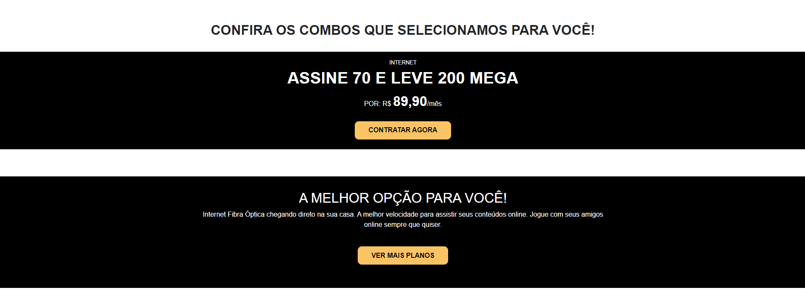

# global-net
Site para um possível cliente proprietário de provedor de internet. 

## Preview 

	

	

	

	

	

## Tarefas 

- [X] Criar estrutura de pastas
- [X] Importar fontes
- [X] Criar estrutura inicial do html
- [X] Criar root com as cores
- [X] Adicionar logo ao header
- [X] Criar navbar 
- [X] Criar dropdown com lista de bairros que atende
- [X] Criar botão com link para whatsapp
- [X] Criar estrutura inicial da primeira seção
- [X] Criar a primeira seção com os cards dos planos 
- [X] Criar estrutura inicial segunda seção
- [X] Criar segunda seção com propagando da empresa
- [X] Criar estrutura inicial da terceira seção
- [X] Criar terceira seção: melhor opção para você
- [X] Criar estrutura inicial da quarta seção
- [X] Criar quarta seção: dúvidas
- [X] Criar quarta seção 1.1 - criar um detail ou dropdown para descrever as maiores dúvidas
- [X] Criar estrutura inicial da quinta seção
- [X] Criar quinta seção: sobre nós
- [X] Criar estrutura inicial do footer
- [X] Criar footer com autor
- [X] Adicionar breakpoints versão desktop: 992px 

## Extra

- [ ] Criar carrossel com divulgação da empresa e planos
